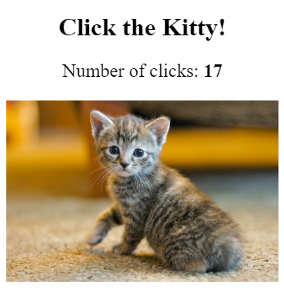
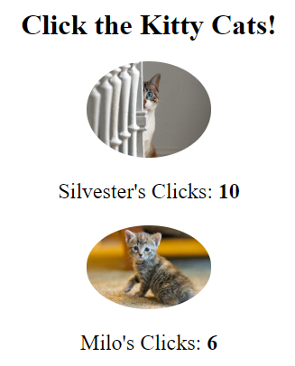
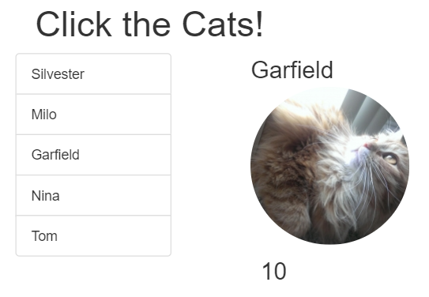
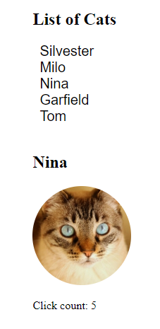
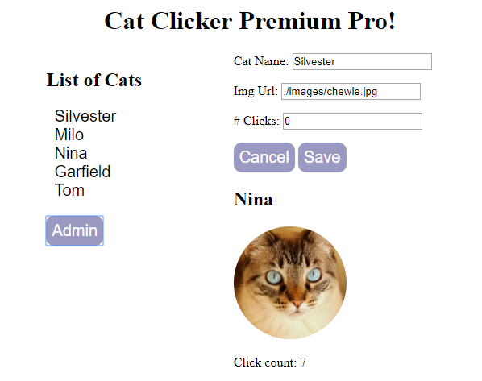

# Cat Clicker

This app was an exercise in Javascript design patterns following [Udacity's Javascript Design Patterns course](https://www.udacity.com/course/javascript-design-patterns--ud989). All of the code is vanilla js (no jquery) for version 1 and 2. For cat clicker premium I used jQuery.

A spec was given to implement. After implementing version 1, the spec was changed. After implementing the new spec, the spec was changed again. And again. The end goal is to show that by planning ahead using [separation of concerns](http://en.wikipedia.org/wiki/Separation_of_concerns) that adding functionality becomes easier and more maneagable to do. 

### Specs

| Display Requirements | Interaction Requirements | Commit Url |
| ------------- | ------------- | :-------------: |
| The application should display a picture of a cat and a number of clicks. | The number of clicks should increment when the cat picture is clicked. | [Cat Clicker version 1](https://github.com/carlotapearl/Udacity-FEND-cat-clicker/tree/aa1702c813aff03ce502f8c3bbf6bd0278c28126)
| The application should display two cats.  Each cat includes: the cat's name, a picture of the cat, text showing the number of clicks. | The number of clicks should increment when each cat picture is clicked. | [Cat Clicker version 2](https://github.com/carlotapearl/Udacity-FEND-cat-clicker/tree/dba000b90033c97b7a14a3c537a14153d9e6973e)
| The application should display: a list of at least 5 cats, listed by name; an area to display the selected cat.  In the cat display area, the following should be displayed: the cat's name, a picture of the cat, text showing the number of clicks. | When a cat name is clicked in the list, the cat display area should update to show the data for the selected cat.  The number of clicks in the cat area should be unique to each cat, and should increment when the cat's picture is clicked. | [Cat Clicker Premium v1](https://github.com/carlotapearl/Udacity-FEND-cat-clicker/tree/master/cat-clicker-premium)
| The application should display: a list of cats by name, an area to display the selected cat.   In the cat display area, the following should be displayed: the cat's name, a picture of the cat, text showing the number of clicks. | When a cat name is clicked in the list, the cat display area should update to show the data for the selected cat.  The number of clicks in the cat area should be unique to each cat, and should increment when the cat's picture is clicked. | [Cat Clicker Premium  rebuilt with MVC](https://github.com/carlotapearl/Udacity-FEND-cat-clicker/tree/master/cat-clicker-MVC)
| The application should display: a list of cats by name, an area to display the selected cat, an admin button, an admin area with inputs for changing the cat's name, url, and number of clicks (hidden by default).  In the cat display area, the following should be displayed: the cat's name, a picture of the cat, text showing the number of clicks. | When a cat name is clicked in the list, the cat display area should update to show the data for the selected cat.  The number of clicks in the cat area should be unique to each cat, and should increment when the cat's picture is clicked.  When the admin button is clicked, the admin area should appear with the inputs filled in for the currently-selected cat.  When the cancel button in the admin area is pressed, the admin area disappears.  When the save button in the admin area is pressed, the currently-selected cat's values update with the values in the admin area, and the admin area disappears. | [Cat Clicker Premium Pro](https://github.com/carlotapearl/Udacity-FEND-cat-clicker/tree/master/cat-clicker-premium-pro)

### [Cat Clicker Version 1](https://github.com/carlotapearl/Udacity-FEND-cat-clicker/tree/aa1702c813aff03ce502f8c3bbf6bd0278c28126)

### [Cat Clicker Version 2](https://github.com/carlotapearl/Udacity-FEND-cat-clicker/tree/dba000b90033c97b7a14a3c537a14153d9e6973e)

### [Cat Clicker Premium](https://github.com/carlotapearl/Udacity-FEND-cat-clicker/tree/master/cat-clicker-premium)

### [Cat Clicker MVC](https://github.com/carlotapearl/Udacity-FEND-cat-clicker/tree/master/cat-clicker-MVC)

### [Cat Clicker Premium Pro](https://github.com/carlotapearl/Udacity-FEND-cat-clicker/tree/master/cat-clicker-premium-pro)
